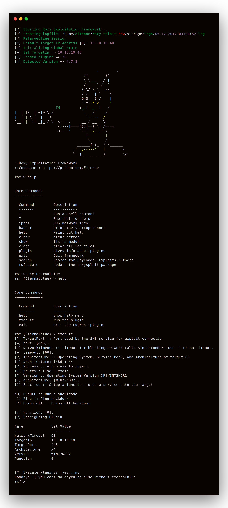

</a>
</a>
</a> 
<h4>Last updated on: 7 April 2018</h4>
<h4>Bitcoin: 15oGX5N4dYFqa21owv8etJ7xkxE8k4jb1v</h4>
<h4>RoxySploit - The Best Framework for Hackers/pentesters</h4>

## How to install
<pre>$ git clone https://github.com/Eitenne/roxysploit.git; cd roxysploit; sudo /usr/bin/python2 installer.py</pre>

## Legal Disclamer:
  The author does not hold any responsibility for the bad use of this tool,
  remember that attacking targets without prior consent is illegal and punished by law.

## Social:
## + <a href="https://discord.gg/7qXa3dg"> Discord</a>
## + <a href="https://www.youtube.com/channel/UCvydKPHB5fzqrJpS6BUqdRQ"> Youtube</a>

## Plugin example
<pre>
Description = 'Some description at the top of the plugin file because its how it works :/'
from plugin_support import *

###################################################
# get.lhost() = Create an input for lhost           #
# ask.lhost = Print out the lhost                 #
##
# ask.target = print out target                   #
# get.target() = Create an input for target         #
##
# ask.lport = print out lport                     #
# get.lport() = Create an input for lport           #
##
# run("options") = Execute a shell command        #
##
# warning("oops becareful")                       #
# fail("oh no something bad happend")             #
# success("Well done") = Create a Success         #
##
# del sys.modules['dave'] = reload module         #
# from dave import * = reimport modules           #
###################################################

get.lhost() #input.lhost
get.lport()
get.target() #input.target
get.mac()

ask.lhost
ask.target
ask.lport
ask.mac
#RELOADS THE CONFIGS (NEEDED IF USING INPUTS)#
del sys.modules['dave']
from dave import *
##############################################
before_execute()
run('uname -a')
warning("There was an issue oh no lol")
fail("RIP get fuked")
success("heheheheheh good well done")
text("random")</pre>

## Video Tutorials
[Hacking using Tresspass | RoxySploit / Roxy Exploitation Framework]: https://www.youtube.com/

## What operating systems support roxysploit?
All Linux distros are currently supported, it is recomended for a prebuilt pentesting os like kali linux although.

## What is roxysploit?
roxysploit is a community-supported, open-source and penetration testing suite that supports attacks for numerous scenarios. conducting attacks in the field.

## Credits
0x5a
